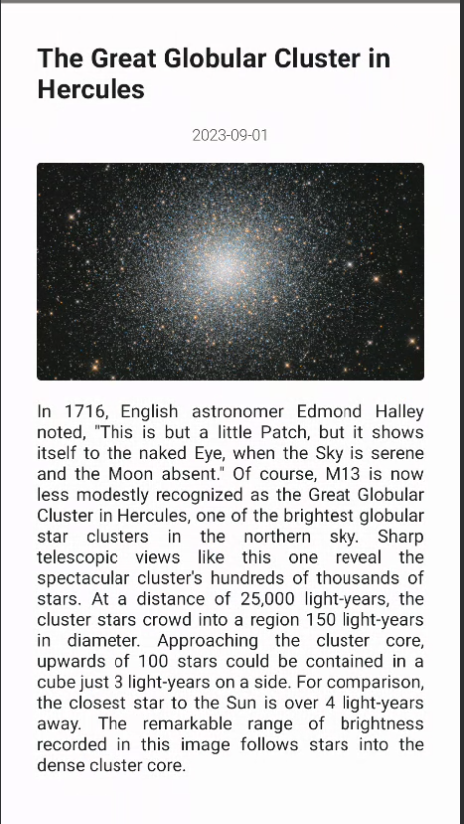

# NASA Image App

An Android app that uses the NASA API to display the Astronomy Picture of the Day.
The app uses the principles of Clean Architecture and provides offline support through Room
Database.

## Features

- Fetch and display the Astronomy Picture of the Day from NASA API
- Uses Clean Architecture (core, data, domain, UI layers)
- Provides offline support through Room Database

## Packages

- **core**
  - **di**: Dependency injection setup with Hilt.
  - **network**: Network-related classes like ApiResponse.
  - **utils**: Utility classes like Constants.

- **data**
  - **remote**: API call classes and DTO (Data Transfer Objects).
  - **repository**: Data source abstraction and repository classes.
  - **local**: Local data source with Room Database entities and DAOs.

- **domain**
  - **model**: Data classes that represent the business logic.
  - **usecase**: Business logic is separated into use cases.

- **ui**
  - **view**: Composable functions that define the UI.
  - **viewmodel**: ViewModel classes that interact with use cases and provide data to UI.

## Dependencies

- Jetpack Compose for UI
- Retrofit for network requests
- Moshi for JSON parsing
- Hilt for Dependency Injection
- Room for offline database
- Kotlin Coroutines for asynchronous programming
- Coil for image loading

## How to Run

1. Clone this repository.
2. Open in Android Studio.
3. Sync Gradle and build the project.
4. Run on an emulator or actual device.

## Screenshots

